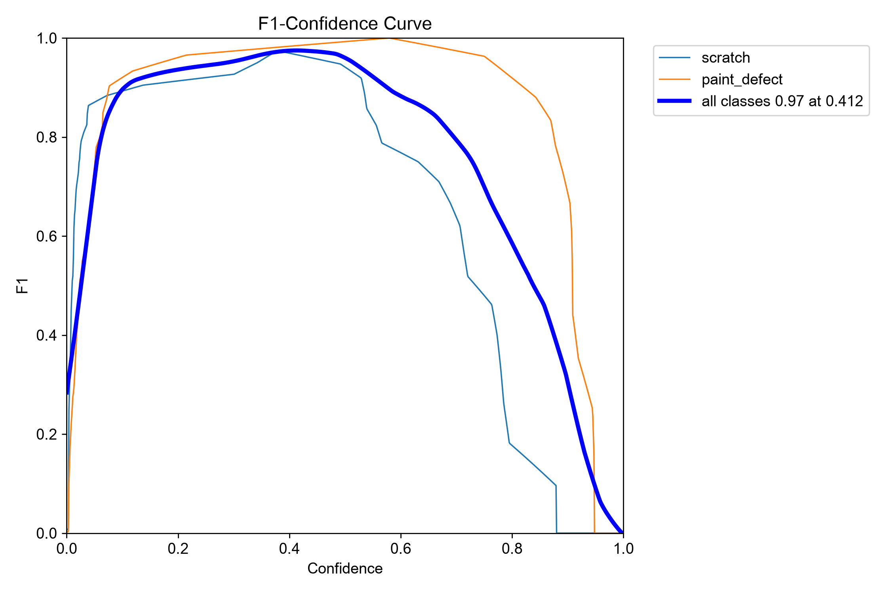
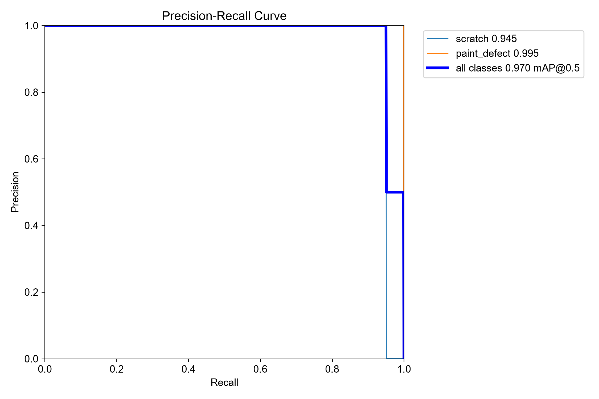
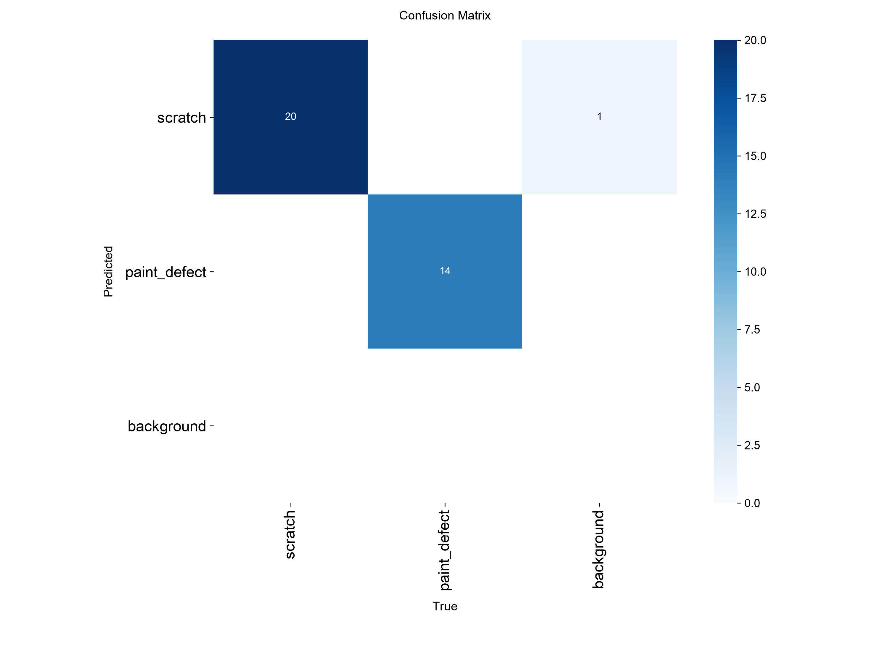
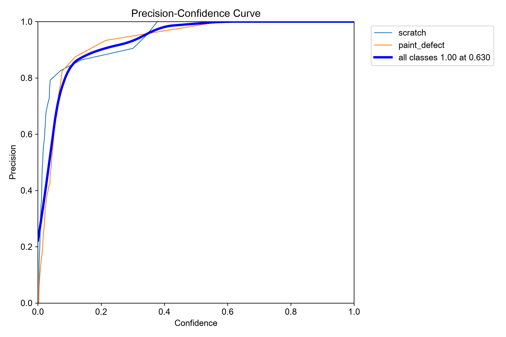
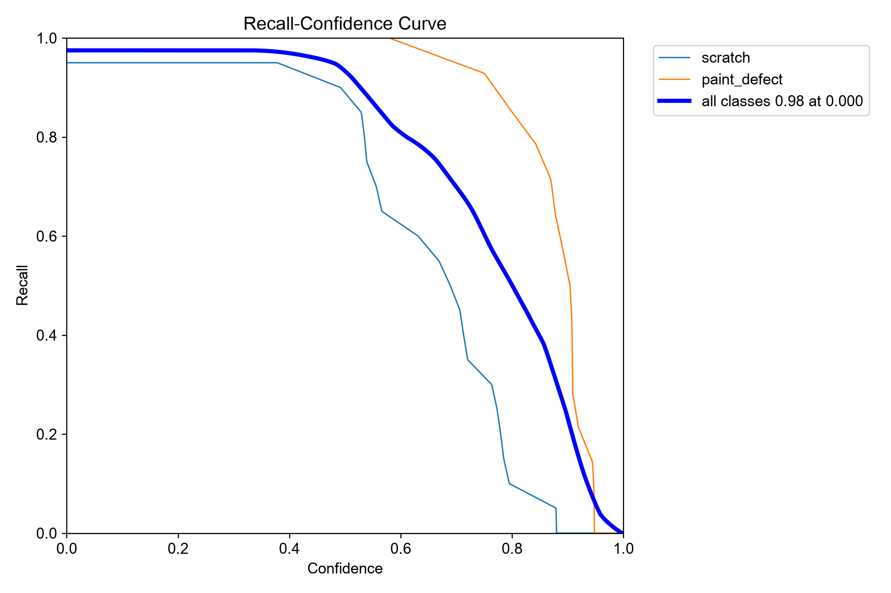

# TriStart Computer Vision Take Home Project 
## Objective
Evaluate the given dataset to determine if parts are good or bad. You have 4 days to complete the project.
This can be done with supervised or unsupervised methods. NOTE: if choosing supervised
methods then use the test set to get good/bad images and redo split.
### Dataset
- [dataset overview](https://github.com/stepanje/MPDD?tab=readme-ov-file)
- [dataset download link](https://drive.google.com/file/d/1b3dcRqTXR7LZkOEkVQ9qO_EcKzzC2EEI/view)

### Parts: 
- Bracket (brown, white, black) and 
- Metal plate
You may choose one part or analyze multiple parts for additional exploration.
    - Do not choose connector or tubes
### Data structure:
- Ground truth: Labeled data for test folder
- Training split: Images for model training are only good parts
- Test split: Images for evaluating model performance
- Subfolders distinguish between good and bad parts
- Some training folders only contain good parts, but you can see more bad parts in
the ground truth folder.
- NOTE: You do not need to do an anomaly detection model, you are free to split
up test set to use a supervised learning approach

## Requirements
1. Code Repository:
    - Create a github repo and push all code to it
    - Add ReadME.md to show how to run repo
2. Preprocessing
    - Implement any preprocessing techniques to prepare data for model training
3. Model Creation
    - Build and train models
4. Post Processing
    - Based on model results look at any post processing techniques to improve
performance.

## Design and Submission
- You have the freedom to choose the model and pre/post processing techniques
    - Example techniques: Object detection, segmentation, classification, and/or
anomaly detection
- Either supervised or unsupervised can done
    - Feel free to use multiple models to compare performance
    - A link to the github repository and any accompany results/plots should be submitted
    - Be prepared to discuss your take-home project in a follow-up meeting
## Extra Note
- Please inform us if you have any questions
- We will assess code structure, model pipeline performance, and chosen techniques
- Even if project isn’t finished we can still review and go over repo with you
## Setup Steps:
1. Virtual Environment:
    ```
    conda create -n tristar_test python=3.12
    conda activate tristar_test
    conda install pip -y
    pip install -r requirements.txt
    ```
2. Download the dataset from the link above and place it inside the repository at the root level.
3. Once anomaly_dataset is placed in the root level of the directory, from inside the virtual environment run:
    1. **1_part_classifier_data_collector.py**: This will create the training_dataset with below structure where all test and train images are in one sub folder and the corresponding masks in the other subfolder for each part type. It also creates all black masks for good parts ground truth and add to the matching ground_truth folder.
    
    2. Then run **2_part_classifier_data_train.py** which creates the stage 1 model to classify the part type. Make sure the line 204 is not commented out for training the model. It also generates a report on the model performance and its evaluation using test and validation datasets. Throughout the work here the data split is always 70% training, 20% validation and 10% test.
    3. Next run **3_defect_segmentation_train.py** 3 times where each time you specify the part type in line 383 which is either metal_plate, brown_bracket or black_bracket. For instance if running for "metal_plate":
    ```
    unet_pipeline = UNetSegmentationModel("training_dataset/metal_plate","training_dataset/metal_plate_ground_truth","metal_plate")
    ```
    Given the imbalance datasets, this stage of the pipeline first counts the number of good and bad samples. It then augments the training data accordingly so the training dataset is more balanced. For the white_bracket since it did not perform well using the unet model, go to yolo folder and run the **yolo_train.py**. The data annotation here is done via [labelstudio](https://labelstud.io/). The **yolo_inference.py** can be used to test your trained yolo model after. 
    4. Finally run **4_defect_inference_pipeline.py** where it goes through the full pipeline on any specified set of images and based on their labels counts the number of miss detections.
    ```
    tristar/
    ├── training_dataset/
    │   ├── bracket_black/
    │   ├── bracket_black_ground_truth/
    │   ├── bracket_brown/
    │   ├── bracket_brown_ground_truth/
    │   ├── bracket_white/
    │   ├── bracket_white_ground_truth/
    │   ├── metal_plate/
    │   └── metal_plate_ground_truth/
    ├── best_stage... .pth (trained model weights)
    ├── yolo
        └── yolo data sets and files 
    ```


## Supervised Learning Method:
1. First classify the item type from the given 4 classes: 1. Brackets (white, brown, blakc) or Metal plate.
2. Then detect whether it's a defect or not. 
***The colors and shapes are fundamentally different. A lightweight backbone like ResNet18 or MobileNetV3 will easily hit near-100% accuracy on this task with very little training.***
```
               ┌──────────────┐
               │  Input Image │
               └──────┬───────┘
                      │
                      ▼
             ┌──────────────────┐
             │     Stage 1:     │
             │ Part Classifier  │
             └────────┬─────────┘
                      │
      ┌───────────────┼───────────────┬───────────────┐
      ▼               ▼               ▼               ▼
 ┌─────────┐     ┌─────────┐     ┌─────────┐     ┌─────────┐
 │  Metal  │     │  Black  │     │  Brown  │     │  White  │
 │  Plate  │     │ Bracket │     │ Bracket │     │ Bracket │
 └────┬────┘     └────┬────┘     └────┬────┘     └────┬────┘
      │               │               │               │
      ▼               ▼               ▼               ▼
┌───────────┐   ┌───────────┐   ┌───────────┐   ┌───────────┐
│ Stage 2A  │   │ Stage 2B  │   │ Stage 2C  │   │ Stage 2D  │
│Defect Det.│   │Defect Det.│   │Defect Det.│   │Defect Det.│
└───────────┘   └───────────┘   └───────────┘   └───────────┘
```
## Resnet18 is used for the first part and here's the performance:
Class mapping found: {'bracket_black': 0, 'bracket_brown': 1, 'bracket_white': 2, 'metal_plate': 3}
Loaded 665 training images, 190 validation images, and 96 test images.

### Evaluating model on the completely unseen test set...

| CLASSIFICATION REPORT: |           |          |         |       |
|------------------------|-----------|----------|---------|-------|
|                        | precision | recall   | f1-score|support|
| bracket_black          | 1.00      | 1.00     | 1.00    | 44    |
| bracket_brown          | 1.00      | 1.00     | 1.00    | 23    |
| bracket_white          | 1.00      | 1.00     | 1.00    | 16    |
| metal_plate            | 1.00      | 1.00     | 1.00    | 13    |
| accuracy               |           |          | 1.00    | 96    |
| macro avg              | 1.00      | 1.00     | 1.00    | 96    |
| weighted avg           | 1.00      | 1.00     | 1.00    | 96    |

### CONFUSION MATRIX:

| True \ Pred   | bracket_black | bracket_brown | bracket_white | metal_plate |
|---------------|---------------|---------------|---------------|-------------|
| bracket_black | 44            | 0             | 0             | 0           |
| bracket_brown | 0             | 23            | 0             | 0           |
| bracket_white | 0             | 0             | 16            | 0           |
| metal_plate   | 0             | 0             | 0             | 13          |

## Stage 2 
Once the part type is defined, UNET model is trained to detect defects.
Given the imbalance in the dataset for good and bad parts:
1. Change the loss function to be dice and cross entrophy 
2. Use data augmentation for training with more bad samples to avoid background bias and false negative.


### Black Bracket
- Unet without offline aug:
    Mean Intersection over Union (mIoU) on Test Set: 0.8150
- Unet with offline aug:
    Mean Intersection over Union (mIoU) on Test Set: 0.6177
- Unet with augmentation without data leakage:
    Mean Intersection over Union (mIoU) on Test Set: 0.8770

### Brown Bracket
- Unet with augmentation without data leakage:
    Mean Intersection over Union (mIoU) on Test Set: 0.8113

### White Bracket
- Unet with augmentation without data leakage:
    Mean Intersection over Union (mIoU) on Test Set: 0.7778

### Metal Plate
- Unet with augmentation without data leakage:
    Mean Intersection over Union (mIoU) on Test Set: 0.9056

First time running on test data, had zero correct detection on white brackets. So changing the loss function to dice+focal to deal with large sea of white pixels.

## White Bracket with focal loss
- Unet with augmentation without data leakage:
    Mean Intersection over Union (mIoU) on Test Set: 0.7814

Given the defects are very hard to distinguish on the white brackets and after not being successful with methods like CLAHE or changing detection threshold. I switched to a yolo model with two classes:
1. scratch
2. paint_defect
To bound box the defect areas on the white bracket samples and trained a small models with only 30 annotated images in label studio.
#### To run label studio:
- Follow [quick start link](https://labelstud.io/quick-start/)
```
docker run -it -p 8080:8080 -v `pwd`/mydata:/label-studio/data heartexlabs/label-studio:latest
```
Running Yolo on the white_bracket addressed all the issues and now it can detect all the defects correctly on the white bracket samples:





Brown parts had a small 5 miss detections as well which I would have done the same steps as in white bracket to optimize the model performance.


### Data Set citation
```
@INPROCEEDINGS{9631567,
  author={Jezek, Stepan and Jonak, Martin and Burget, Radim and Dvorak, Pavel and Skotak, Milos},
  booktitle={2021 13th International Congress on Ultra Modern Telecommunications and Control Systems and Workshops (ICUMT)}, 
  title={Deep learning-based defect detection of metal parts: evaluating current methods in complex conditions}, 
  year={2021},
  volume={},
  number={},
  pages={66-71},
  doi={10.1109/ICUMT54235.2021.9631567}
}

```